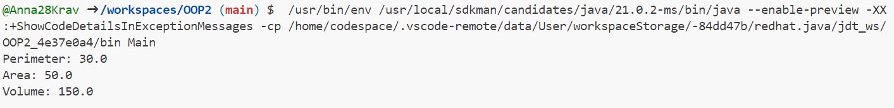

# OOP2

# **Завдння 3**

**3.1) Як основа використовувати вихідний текст проекту попередньої лабораторної роботи. Забезпечити розміщення результатів обчислень уколекції з можливістю збереження/відновлення:**

**Код CalculationData:**
````java
import java.io.Serializable;

// Клас, що представляє дані для обчислень
class CalculationData implements Serializable {
    private static final long serialVersionUID = 1L;
    private double length;
    private double width;
    private double height;

    // Конструктор класу
    public CalculationData(double length, double width, double height) {
        this.length = length;
        this.width = width;
        this.height = height;
    }

    // Методи для обчислення периметру, площі та об'єму
    public double calculatePerimeter() {
        return 2 * (length + width);
    }

    public double calculateArea() {
        return length * width;
    }

    public double calculateVolume() {
        return length * width * height;
    }

    // Геттери для отримання параметрів
    public double getLength() {
        return length;
    }

    public double getWidth() {
        return width;
    }

    public double getHeight() {
        return height;
    }

    // Виведення результатів у текстовому вигляді
    public String displayResults(CalculationResultDisplay display) {
        StringBuilder result = new StringBuilder();
        result.append(display.displayPerimeter(calculatePerimeter())).append("\n");
        result.append(display.displayArea(calculateArea())).append("\n");
        result.append(display.displayVolume(calculateVolume())).append("\n");
        return result.toString();
    }
}

// Клас для розрахунку об'єктів кімнати
class Room implements Serializable {
    private static final long serialVersionUID = 1L;
    private double length;
    private double width;
    private transient double height; // Поле height буде transient

    // Конструктор класу
    public Room(double length, double width, double height) {
        this.length = length;
        this.width = width;
        this.height = height;
    }

    // Метод для розрахунку периметру
    public double calculatePerimeter() {
        return 2 * (length + width);
    }

    // Метод для розрахунку площі
    public double calculateArea() {
        return length * width;
    }

    // Метод для розрахунку об'єму
    public double calculateVolume() {
        return length * width * height;
    }

    // Метод для виведення інформації про кімнату
    public String displayInfo(CalculationResultDisplay display) {
        StringBuilder result = new StringBuilder();
        result.append(display.displayPerimeter(calculatePerimeter())).append("\n");
        result.append(display.displayArea(calculateArea())).append("\n");
        result.append(display.displayVolume(calculateVolume())).append("\n");
        return result.toString();
    }
}
````

**3.2) Використовуючи шаблон проектування Factory Method (Virtual Constructor), розробити ієрархію, що передбачає розширення рахунок додавання нових відображуваних класів:**

**Код CalculationDataFactoryImpl:**
````java
// Реалізація фабрики для CalculationData
class CalculationDataFactoryImpl implements CalculationDataFactory {
    @Override
    public CalculationData createCalculationData(double length, double width, double height) {
        return new CalculationData(length, width, height);
    }
}
````

**3.3) Розширити ієрархію інтерфейсом "фабрикованих" об'єктів, що представляє набір методів для відображення результатів обчислень:**

**Код CalculationResultDisplay:**
````java
// Інтерфейс для "фабрикованих" об'єктів, що представляє набір методів для відображення результатів обчислень
interface CalculationResultDisplay {
    String displayPerimeter(double perimeter);
    String displayArea(double area);
    String displayVolume(double volume);
}

// Інтерфейс для "фабрикуючого" методу
interface CalculationDataFactory {
    CalculationData createCalculationData(double length, double width, double height);
}
````

**3.4) Реалізувати ці методи виведення результатів у текстовому виде:**

**Код Main:**
````java
public class Main {
    public static void main(String[] args) {
        // Створюємо об'єкт CalculationData через фабрику
        CalculationDataFactory factory = new CalculationDataFactoryImpl();
        CalculationData data = factory.createCalculationData(10.0, 5.0, 3.0);

        // Виконуємо обчислення та виводимо результати
        CalculationResultDisplay display = new TextCalculationResultDisplay();
        System.out.println(data.displayResults(display));
    }
}
````

**3.5) Розробити тареалізувати інтерфейс для "фабрикуючого" методу:**

**Код TextCalculationResultDisplay:**
````java
// Клас для відображення результатів обчислень у текстовому вигляді
class TextCalculationResultDisplay implements CalculationResultDisplay {
    @Override
    public String displayPerimeter(double perimeter) {
        return "Perimeter: " + perimeter;
    }

    @Override
    public String displayArea(double area) {
        return "Area: " + area;
    }

    @Override
    public String displayVolume(double volume) {
        return "Volume: " + volume;
    }
}
````
**Фото роботи програми:**


